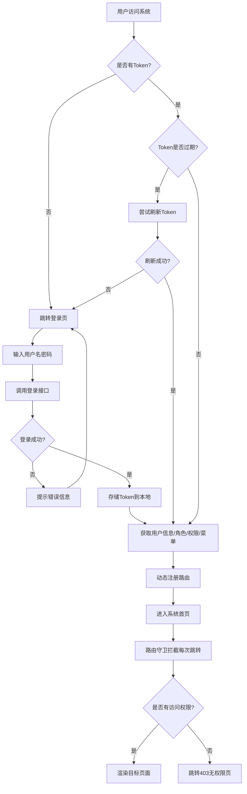
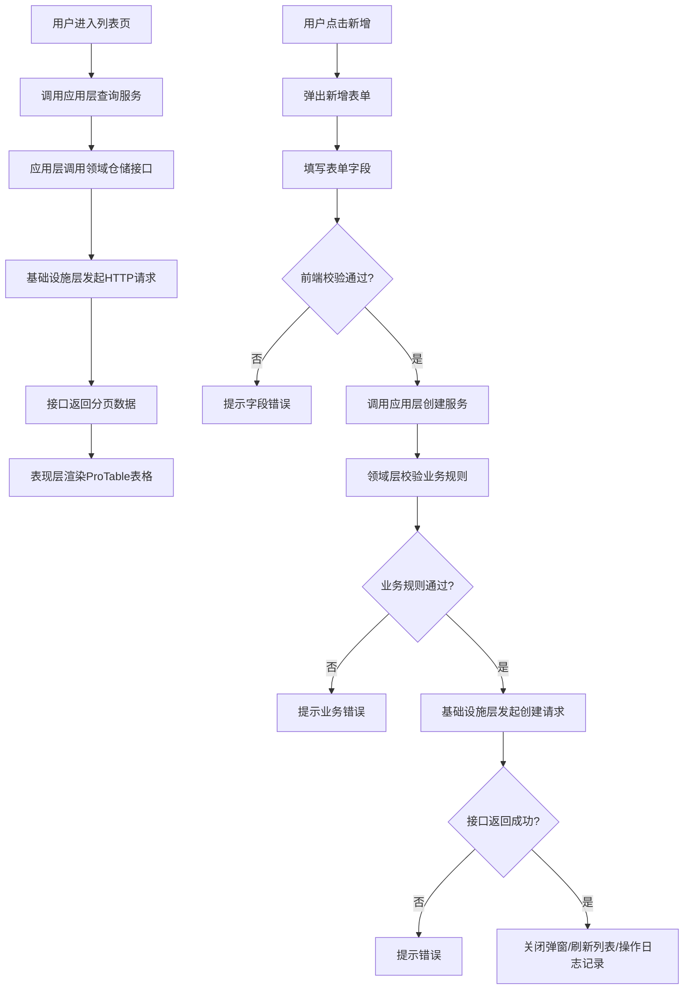
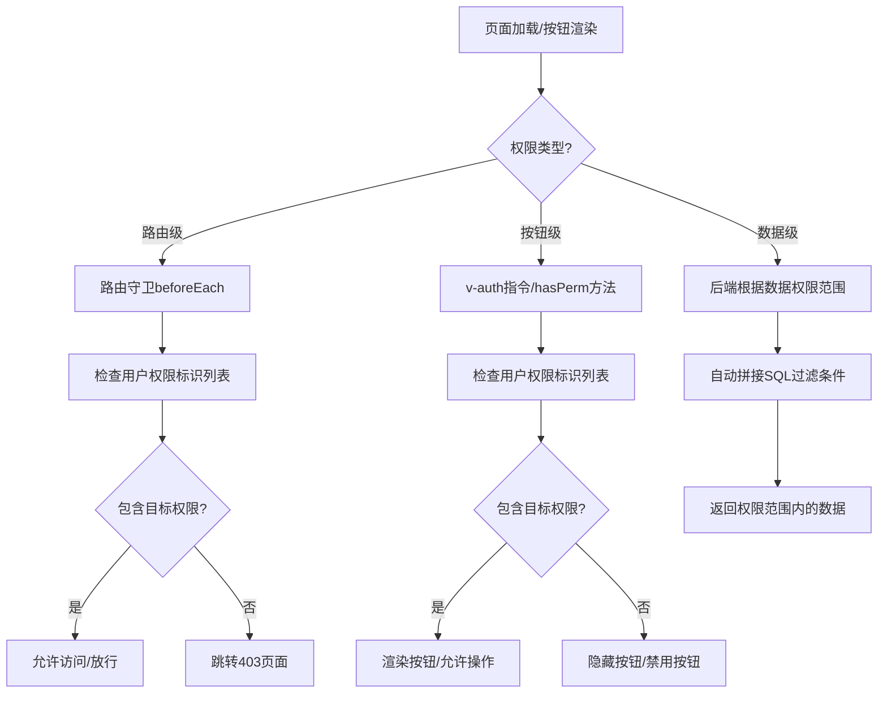
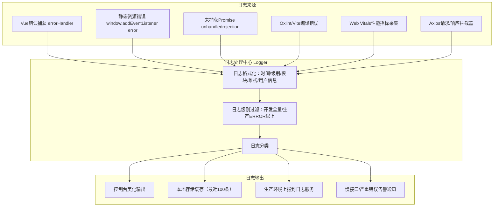
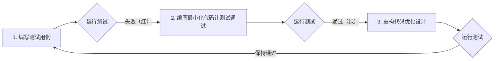

# 系统架构设计文档

## 一、DDD 领域驱动分层架构

本项目严格遵循 DDD（领域驱动设计）四层架构思想，从下到上依次为：基础设施层、领域层、应用层、表现层。各层职责清晰，依赖方向单向向下，上层可以依赖下层，下层绝不可以依赖上层。

### 1.1 架构分层图

```
┌─────────────────────────────────────────────────────────────────┐
│                        表现层 (Presentation)                    │
│  ┌─────────────────────────────────────────────────────────┐   │
│  │  Vue 组件 / 页面 / 布局 / 指令 / 路由守卫               │   │
│  │  职责：接收用户输入，调用应用层服务，展示数据             │   │
│  └─────────────────────────────────────────────────────────┘   │
├─────────────────────────────────────────────────────────────────┤
│                        应用层 (Application)                     │
│  ┌─────────────────────────────────────────────────────────┐   │
│  │  应用服务 / DTO / 命令(Command) / 查询(Query)           │   │
│  │  职责：编排领域服务，协调多个领域对象完成业务用例         │   │
│  │  不包含业务逻辑，仅做流程编排                            │   │
│  └─────────────────────────────────────────────────────────┘   │
├─────────────────────────────────────────────────────────────────┤
│                         领域层 (Domain)                         │
│  ┌─────────────────────────────────────────────────────────┐   │
│  │  实体(Entity) / 值对象(ValueObject) / 领域服务          │   │
│  │  聚合根(AggregateRoot) / 领域事件 / 仓储接口            │   │
│  │  职责：核心业务逻辑实现，业务规则校验                     │   │
│  │  不依赖任何外层，不依赖具体基础设施                       │   │
│  └─────────────────────────────────────────────────────────┘   │
├─────────────────────────────────────────────────────────────────┤
│                      基础设施层 (Infrastructure)                 │
│  ┌─────────────────────────────────────────────────────────┐   │
│  │  仓储实现 / API 请求 / 日志 / 缓存 / 第三方服务集成     │   │
│  │  职责：实现领域层定义的仓储接口，提供技术能力支撑         │   │
│  └─────────────────────────────────────────────────────────┘   │
└─────────────────────────────────────────────────────────────────┘
```

### 1.2 目录结构映射DDD分层

```
src/
├── presentation/          # 🔵 表现层
│   ├── components/        # 全局公共组件
│   ├── layouts/           # 布局组件
│   ├── views/             # 页面组件（按业务模块划分）
│   │   ├── system/        # 系统管理模块页面
│   │   │   ├── user/
│   │   │   ├── role/
│   │   │   ├── menu/
│   │   │   └── ...
│   ├── directives/        # 自定义指令
│   ├── router/            # 路由配置
│   └── styles/            # 全局样式
│
├── application/           # 🟢 应用层
│   ├── services/          # 应用服务（按模块划分）
│   │   ├── user.service.ts
│   │   ├── role.service.ts
│   │   └── ...
│   ├── dto/               # 数据传输对象
│   │   ├── user.dto.ts
│   │   └── ...
│   ├── commands/          # 写操作命令
│   └── queries/           # 读操作查询
│
├── domain/                # 🟡 领域层
│   ├── user/              # 用户领域
│   │   ├── user.entity.ts         # 用户实体
│   │   ├── user.value-object.ts   # 用户值对象
│   │   ├── user.domain-service.ts # 用户领域服务
│   │   └── user.repository.ts     # 用户仓储接口
│   ├── role/              # 角色领域
│   ├── menu/              # 菜单领域
│   ├── dept/              # 部门领域
│   ├── dict/              # 字典领域
│   └── shared/            # 共享领域内核
│       ├── base.entity.ts         # 基础实体
│       ├── base.value-object.ts   # 基础值对象
│       └── result.ts              # 统一返回结果
│
├── infrastructure/        # 🔴 基础设施层
│   ├── repositories/      # 仓储实现
│   │   ├── user.repository.impl.ts
│   │   └── ...
│   ├── http/              # HTTP请求封装 + 接口日志
│   ├── cache/             # 缓存实现
│   ├── logger/            # 日志体系（五大类日志）
│   └── storage/           # 本地存储封装
│
├── stores/                # Pinia状态管理（跨层状态）
├── hooks/                 # 组合式函数
├── utils/                 # 工具函数
└── main.ts                # 应用入口
```

### 1.3 各层职责详细说明

| 层级 | 职责 | 可包含内容 | 禁止包含内容 |
|------|------|-----------|-------------|
| **表现层** | 负责与用户交互，展示数据，接收用户输入 | Vue组件、页面、布局、指令、路由守卫、表单校验 | 业务逻辑、API直接调用、数据转换 |
| **应用层** | 编排业务流程，协调领域对象完成用例，不包含业务规则 | 应用服务、DTO、Command、Query、事务编排 | 核心业务逻辑、直接调用HTTP |
| **领域层** | 核心业务逻辑、业务规则校验、业务状态变更，系统核心 | 实体、值对象、聚合根、领域服务、仓储接口、领域事件 | HTTP请求、组件依赖、框架依赖 |
| **基础设施层** | 提供技术能力实现，实现领域层定义的接口 | 仓储实现、HTTP请求、日志、缓存、存储、第三方集成 | 业务逻辑 |

---

## 二、系统模块流程图

### 2.1 用户登录认证流程



### 2.2 系统管理模块通用CRUD流程



### 2.3 权限判断流程



---

## 三、完整日志体系架构

### 3.1 五大类日志分类

| 日志类型 | 捕获范围 | 输出位置 | 级别 | 生产环境是否开启 |
|---------|---------|---------|------|-----------------|
| **项目全局错误日志** | Vue组件渲染错误、未捕获Promise异常、全局运行时错误 | 控制台 + 日志上报接口 + 本地日志文件(开发) | ERROR | ✅ 开启 |
| **文件/资源加载错误日志** | JS/CSS/图片/字体等静态资源加载失败、Chunk加载失败 | 控制台 + 日志上报接口 | ERROR | ✅ 开启 |
| **Oxlint规范错误日志** | 开发阶段代码规范错误、语法错误、类型错误、React/Vue规则违规 | 控制台 + Vite HMR overlay + Oxlint 插件实时检查 | WARNING/ERROR | ⚠️ 仅开发环境 |
| **性能监控日志** | FCP/LCP/FID/CLS等Web Vitals指标、页面加载时间、接口耗时、组件渲染耗时 | 控制台 + 性能上报接口（采样率10%） | INFO | ✅ 开启（采样） |
| **接口请求日志** | 所有HTTP请求的URL/方法/参数/响应/状态码/耗时 | 控制台(开发) + 慢接口告警(>3s) | INFO/WARNING/ERROR | ✅ 开发全量/生产慢接口 |

### 3.2 日志输出流程图



### 3.3 日志格式规范

每条日志统一包含以下字段：

| 字段 | 说明 | 示例 |
|------|------|------|
| timestamp | 时间戳 | 2026-09-08T12:00:00.000Z |
| level | 日志级别 | DEBUG / INFO / WARNING / ERROR / FATAL |
| module | 所属模块 | system/user |
| message | 日志消息 | 用户列表查询失败 |
| stack | 错误堆栈（ERROR级别） | Error: ... at ... |
| userId | 当前用户ID（登录后） | 1001 |
| url | 当前页面URL | /system/user |
| userAgent | 浏览器信息 | Chrome/128.0.0.0 |
| duration | 耗时（接口/性能日志） | 1234ms |
| extra | 额外数据 | 请求参数、响应数据等 |

---

## 四、TDD 测试驱动开发方案

### 4.1 测试分层策略

```
┌─────────────────────────────────────────┐
│          E2E端到端测试 (Cypress)        │  覆盖核心业务流程
│              占比 10%                   │
├─────────────────────────────────────────┤
│          组件测试 (Vue Test Utils)      │  覆盖组件交互、渲染
│              占比 30%                   │
├─────────────────────────────────────────┤
│          单元测试 (Vitest)              │  覆盖工具函数、领域服务、应用服务
│              占比 60%                   │
└─────────────────────────────────────────┘
```

### 4.2 TDD 开发流程（红-绿-重构）



### 4.3 测试覆盖率要求

| 层级 | 要求覆盖率 | 说明 |
|------|-----------|------|
| 领域服务 | 100% | 核心业务逻辑必须全覆盖 |
| 工具函数 | 100% | 纯函数无副作用，容易覆盖 |
| 应用服务 | ≥ 90% | 流程编排逻辑 |
| 组件 | ≥ 70% | 核心交互组件重点覆盖 |
| 仓储实现 | ≥ 60% | Mock接口测试 |
| **整体** | **≥ 80%** | 项目整体覆盖率要求 |

### 4.4 测试目录结构

```
src/
├── domain/user/
│   ├── user.entity.ts
│   └── __tests__/
│       └── user.entity.spec.ts    # 实体单元测试
├── application/services/
│   ├── user.service.ts
│   └── __tests__/
│       └── user.service.spec.ts   # 应用服务测试
├── utils/
│   ├── format.ts
│   └── __tests__/
│       └── format.spec.ts         # 工具函数测试
└── __tests__/
    ├── components/                # 组件测试
    │   └── ProTable.spec.ts
    └── e2e/                       # E2E测试
        └── login.spec.ts
```